# DBProject5785_4618_7706

## תוכן עניינים  
- [שלב 1: תכנון ובניית מסד הנתונים](#שלב-1-תכנון-ובניית-מסד-הנתונים)  
  - [מבוא](#מבוא)  
  - [ERD (תרשים ישויות-קשרים)](#erd-תרשים-ישויות-קשרים)  
  - [DSD (תרשים מבנה נתונים)](#dsd-תרשים-מבנה-נתונים)  
  - [סקריפטים ב-SQL](#סקריפטים-ב-sql)  
  - [נתונים](#נתונים)  
  - [גיבוי](#גיבוי)  
- [שלב 2: שאילתות ואילוצים](#שלב-2-שאילתות-ואילוצים)
  - [שאילתות SELECT](#שאילתות-SELECT)
  - [שאילתות DELETE](#שאילתות-DELETE)
  - [שאילתות UPDATE](#שאילתות-UPDATE)
  - [אילוצים](#אילוצים)
  - [ביצוע Rollback וCommit ](#ביצוע-rollbac-ו-commit )
  - [גיבוי מעודכן](#גיבוי-מעודכן)
- [שלב 3: אינטגרציה ומבטים](#שלב-3-אינטגרציה-ומבטים)
  - [מבוא](#מבוא2)
  - [תרשים DSD של המערכת החדשה](#תרשים-DSD-של-המערכת-החדשה)
  - [תהליך הנדסה הפוכה (Reverse Engineering)](#תהליך-הנדסה-הפוכה) 
  - [תרשים ERD של המערכת החדשה](#תרשים-ERD-של-המערכת-החדשה)
  - [ניתוח והשוואת המערכות](#ניתוח-והשוואת-המערכות)
  - [תהליך האינטגרציה](#תהליך-האינטגרציה)
  - [תרשים ERD משולב](#תרשים-ERD-משולב)
  - [החלטות אינטגרציה](#החלטות-אינטגרציה)
  - [תהליך מיפוי הנתונים](#תהליך-מיפוי-הנתונים)
  - [הסבר הפקודות SQL](#הסבר-הפקודות-sql)
  - [אתגרים ופתרונות](#אתגרים-ופתרונות)
  - [מסקנות](#מסקנות)
  - [מבטים](#מבטים)
  - [גיבוי מעודכן](#גיבוי-מעודכן2)
- [שלב 4: תכנות PL/pgSQL](#שלב-4:-תכנות-PL/pgSQL)
  - [פונקציות](#פונקציות)
  - [פרוצדורות](#פרוצדורות)
  - [טריגרים](#טריגרים)
  - [תוכניות ראשיות](#תוכניות-ראשיות)

## שלב 1: תכנון ובניית מסד הנתונים  

### מבוא

# מערכת ניהול מכון כושר

## תיאור הפרויקט

מערכת ניהול מכון הכושר נועדה לייעל את תהליך הארגון והמעקב אחר מידע חיוני הקשור למנויים, מדריכים, סוגי שיעורים, ציוד וחדרים. מערכת זו מאפשרת למנהלי מכון הכושר, למדריכים ולמנויים גישה נוחה למידע מעודכן, תוך שמירה על מבנה נתונים יעיל ומסודר.

## מטרת המערכת

מסד נתונים זה משמש כפתרון מובנה ואמין למכוני כושר על מנת:

- לנהל רשימת מנויים, כולל תאריכי רישום ותוקף המנוי.
- לקשר מדריכים מוסמכים לסוגי שיעורים שונים בהתאם לרמת הניסיון הנדרשת.
- לארגן שיעורים על פי ימים בשבוע, שעות, סוגים והדרישות המיוחדות לכל שיעור.
- לנהל את החדרים הזמינים במכון ולהבטיח שהקיבולת מתאימה לשיעורים המתוכננים.
- לעקוב אחר ציוד הכושר, כולל מצבו ומיקומו.

## מקרי שימוש פוטנציאליים

- **מנהלי מכון הכושר** יכולים להשתמש במערכת לניהול מנויים, שיעורים, מדריכים וחדרים באופן יעיל ומסודר.
- **מדריכים** יכולים לבדוק אילו שיעורים הם מוסמכים להעביר, אילו חדרים זמינים ולהירשם להעברת שיעורים בהתאם לניסיונם.
- **מנויים** יכולים להירשם לשיעורים השונים בהתאם למגדרם ולהעדפותיהם ולוודא שהשיעורים מותאמים לרמתם ולצרכיהם.
- **צוות המכון** יכול לעקוב אחר מצב הציוד ולוודא תחזוקה שוטפת של חדרי הכושר והאביזרים.

מסד נתונים זה מסייע לייעול הניהול, לשיפור הארגון ולשמירה על חוויית אימון אופטימלית עבור כלל המשתמשים.


###  ERD (תרשים ישויות-קשרים)    
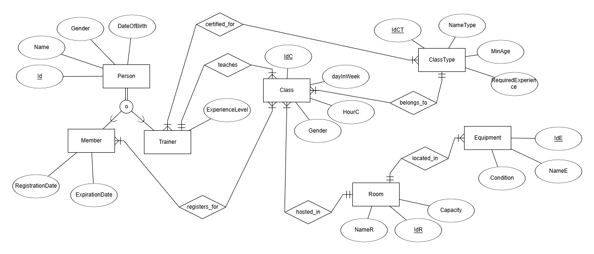  

###  DSD  (תרשים מבנה נתונים)
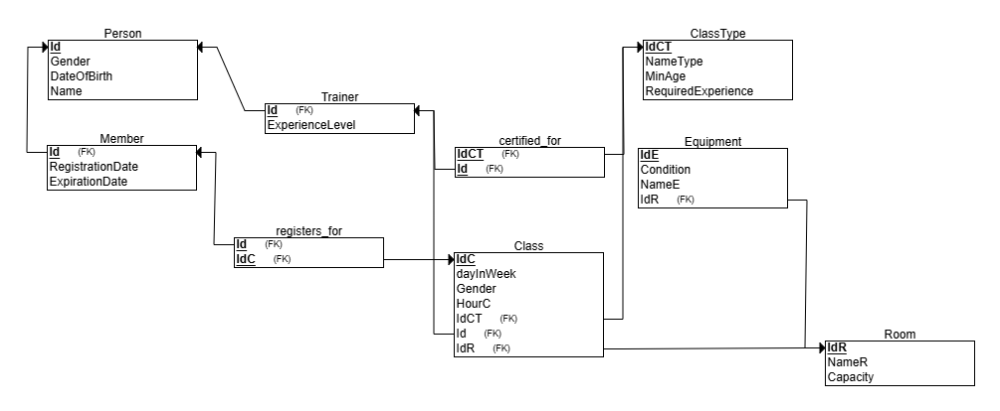  

### סקריפטים ב-SQL  
ספק את סקריפטי ה-SQL הבאים:  
- **סקריפט יצירת טבלאות** - הסקריפט ליצירת טבלאות מסד הנתונים זמין במאגר:  

📜 **[צפייה ב-create_tables.sql](Stage1/scripts/createTable.sql)**  

- **סקריפט הוספת נתונים** - הסקריפט להזנת נתונים לטבלאות מסד 


הנתונים זמין במאגר:  

📜 **[צפייה ב-insert_tables.sql](Stage1/scripts/insertTables.sql)**  

- **סקריפט מחיקת טבלאות** - הסקריפט למחיקת כל הטבלאות זמין במאגר:  

📜 **[צפייה ב-drop_tables.sql](Stage1/scripts/dropTables.sql)**  

- **סקריפט שליפת כל הנתונים** - הסקריפט לשליפת כל הנתונים מכל הטבלאות זמין במאגר:  

📜 **[צפייה ב-selectAll_tables.sql](Stage1/scripts/selectAll.sql)**

### נתונים  
#### כלי ראשון: שימוש ב-[Mockaroo](https://www.mockaroo.com/) ליצירת קובץ CSV  
##### הזנת נתונים לטבלת person  
- טווח מזהי person: 1-800  
📜 [צפייה ב-`Person.csv`](Stage1/mockData/Person.csv)  

##### הזנת נתונים לטבלת Member  
- טווח מזהי person: 1-400  
📜 [צפייה ב-`Member.csv`](Stage1/mockData/Member.csv)  
 
##### הזנת נתונים לטבלת Trainer
- טווח מזהי person: 401-800  
- נוסחת מזהה איש: `this + 400`  
📜 [צפייה ב-`Trainer.csv`](Stage1/mockData/Trainer.csv)  


### דוגמה להמחשת העבודה באתר עבור הטבלה Person: 
- הגדרת סוגי תכונות הישות ושמותיהם באתר
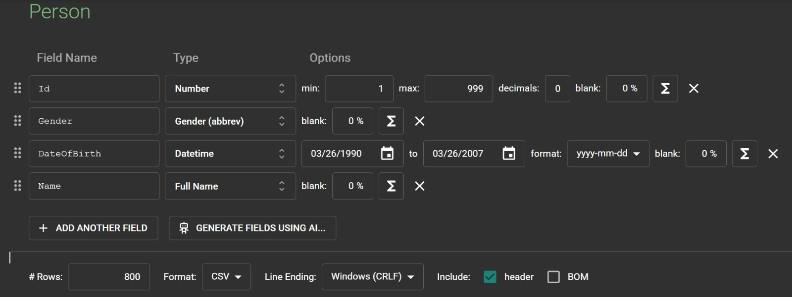
- העלאת הקובץ שנוצר למאגר ע"י עמידה על הטבלה של Person, לחיצה ימנית ו- Import->Export Data
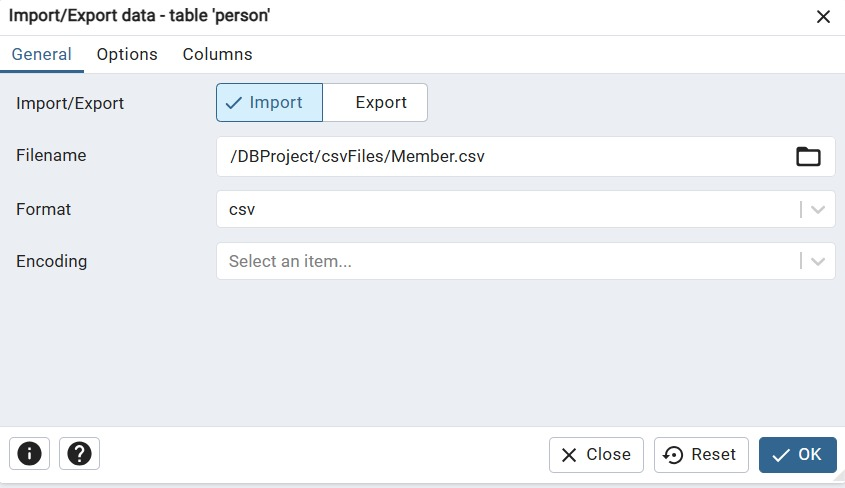
 - תוצאת השאילתא `;SELECT * FROM Person`:
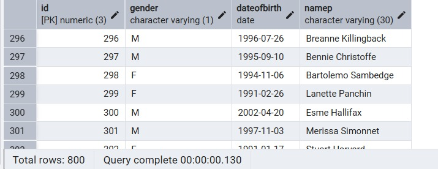
   

### כלי שני: שימוש ב-[generatedata](https://generatedata.com/generator) ליצירת קובץ CSV  
##### הזנת נתונים לטבלת Room  
- טווח מספרי קבוצה: 1-400  
📜 [צפייה ב-`Room.csv`](Stage1/genData/Room.csv)
##### הזנת נתונים לטבלת Class  
- טווח מספרי קבוצה: 1-400  
📜 [צפייה ב-`Class.csv`](Stage1/genData/Class.csv)
##### הזנת נתונים לטבלת ClassType  
- טווח מספרי קבוצה: 1-400  
📜 [צפייה ב-`ClassType.csv`](Stage1/genData/ClassType.csv)  

### דוגמה להמחשת העבודה באתר עבור הטבלה ClassType: 
- הגדרת סוגי תכונות הישות ושמותיהם באתר

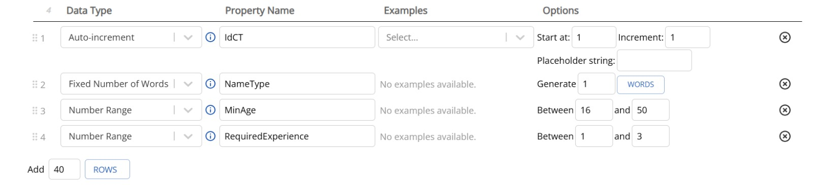

- עריכת ההגדרות להוצאת קובץ בפורמט CSV


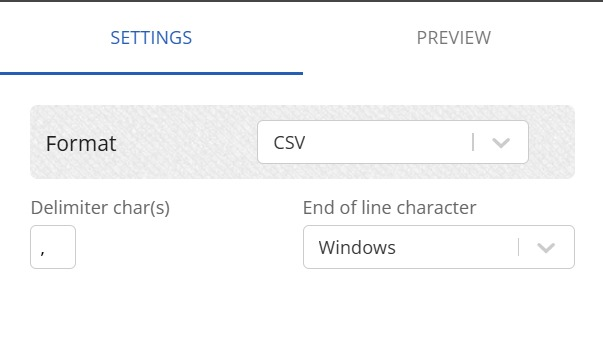

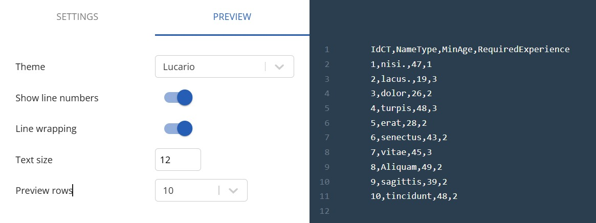


- יצירת 400 רשומות לטבלה ולחיצה על Generate
  
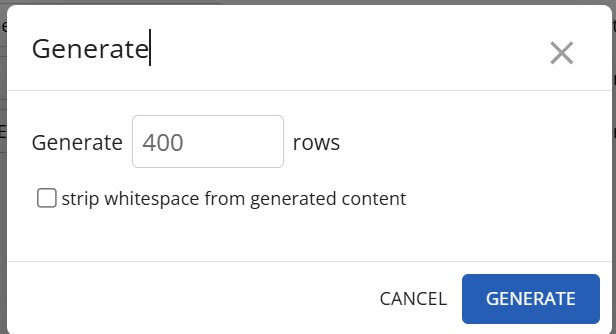


- העלאת הקובץ הנוצר למאגר וקבלת האישור להלן

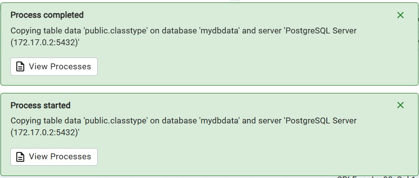

 - תוצאת השאילתה `;SELECT 'ClassType' AS table_name, COUNT(*) FROM ClassType`:

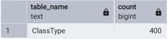


#### כלי שלישי: שימוש ב-Python ליצירת קבצי CSV
##### יצירת נתונים לטבלת Equipment
- טווח מספרי קבוצה: 1-400  
📜 [צפייה ב-`Equipment.csv`](Stage1/pythonData/Equipment.csv)
##### יצירת נתונים לטבלת Certified_For  
- שני מפחתות זרים ע"פ טווחיהם
📜 [צפייה ב-`Certified_For.csv`](Stage1/pythonData/Certified_For.csv)
##### יצירת נתונים לטבלת Registers_For  
- שני מפתחות זרים ע"פ טווחיהם  
📜 [צפייה ב-`Registers_For.csv`](Stage1/pythonData/Registers_For.csv)

##### סקריפט היצירה: [צפייה ב-`genCSV.py`](Stage1/pythonData/genCSV.py)
- 3 קבצי הCSV שהסקריפט יצר הועלאו בהצלחה למאגר

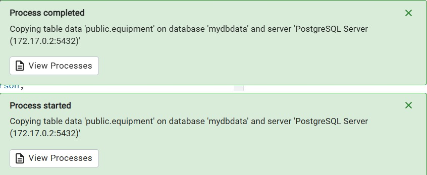

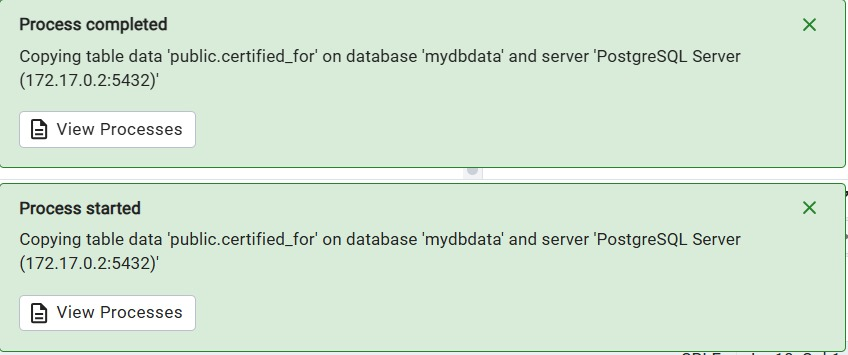

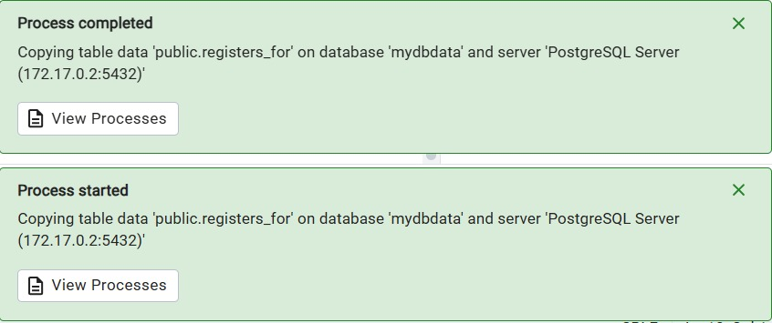


### גיבוי  
- קבצי הגיבוי נשמרים עם התאריך והשעה של מועד הגיבוי:
  
📜 [צפייה בתיקיית הגיבויים-`Backups`](Stage1)

- הצד המגבה: עומד על המאגר, לחיצה ימנית ובוחר את האפשרות של Backup.
- יש לבחור בפורמט Tar ולקרא לקובץ בשם backup_dd_mm_yy_hh_mi למען הסדר הטוב.
 


- הצד המשחזר: דואג שקובץ הגיבוי שנוצר יהיה נמצא אצלו בStorage Manager, עומד על המאגר, לחיצה ימנית ובוחר את האפשרות של Restore
- ובוחר את קובץ הגיבוי המדובר
  


## שלב 2: אינטגרציה ושאילתות
### שאילתות SELECT
📜 [צפייה בקובץ כל השאילתות-`Queries.sql`](Stage2)

#### שאילתה 1
**תיאור:**
השאילתה מחזירה את כל המדריכים (trainers) שהם גברים. היא מציגה את תעודת הזהות שלהם, שם, גיל ורמת ניסיון. התוצאה ממויינת לפי רמת הניסיון בסדר עולה ומיון משני לפי שם בסדר אלפביתי.

**השאילתה רצה בהצלחה:**


**צילום תוצאת השאילתה:**


---

#### שאילתה 2
**תיאור:**
השאילתה מחזירה את מספר השיעורים שכל מדריך מלמד, יחד עם שמו. התוצאות ממויינות לפי כמות השיעורים בסדר יורד.

**השאילתה רצה בהצלחה:**


**צילום תוצאת השאילתה:**


---

#### שאילתה 3
**תיאור:**
השאילתה מציגה את רשימת המנויים שהמנוי שלהם יפוג בחודש הבא, כולל שם המנוי ותאריך התפוגה. התוצאות ממויינות לפי תאריך התפוגה בסדר עולה.

**הרצת השאילתה:**


**צילום תוצאת השאילתה:**


---

#### שאילתה 4
**תיאור:**
השאילתה מציגה את פרטי השיעורים שמתקיימים היום: יום בשבוע, מזהה שיעור, שעה, סוג שיעור, מזהה המדריך, רמת הניסיון של המדריך ושם החדר.

**הרצת השאילתה:**


**צילום תוצאת השאילתה:**


---

#### שאילתה 5
**תיאור:**
השאילתה מציגה את כל השיעורים אליהם מנוי בעל מזהה 1 רשום, כולל שם המנוי, מזהה השיעור, סוג השיעור, יום בשבוע, שעה ושם החדר.

**הרצת השאילתה:**


**תוצאת השאילתה:**


---

#### שאילתה 6
**תיאור:**
השאילתה מציגה את פרטי החדרים הפנויים היום (חדרים שלא מתקיים בהם שיעור), כולל מזהה החדר, שם החדר ותכולת החדר. התוצאות ממויינות לפי שם החדר.

**הרצת השאילתה:**


**תוצאת השאילתה:**


---

#### שאילתה 7
**תיאור:**
השאילתה מציגה את פרטי המנויים שרשומים לשיעור מסויים (מזהה שיעור 5). מוצגים תעודת זהות, שם, מגדר ותאריך לידה של כל מנוי.


**הרצת השאילתה:**


**תוצאת השאילתה:**


---

#### שאילתה 8
**תיאור:**
השאילתה מציגה את כל השיעורים שהגבלת גיל המינימלית שלהם מתאימה לגיל 19 (כלומר, המינימום הוא 19 או פחות). מוצגים מזהה שיעור, יום בשבוע, שעה, סוג שיעור, גיל מינימלי נדרש ושם החדר.

**הרצת השאילתה:**


**תוצאת השאילתה:**


---

### שאילתות DELETE
#### 🔻 שאילתה 1 – מחיקת מדריכים בעלי ניסיון נמוך שלא מעבירים שיעורים

**תיאור:**  
בשאילתה זו נמחקים מדריכים (Trainer) בעלי רמת ניסיון 1, אשר אינם משויכים לאף שיעור בטבלה `Class`. כלומר, מדריכים חסרי ניסיון שלא מעבירים בפועל שיעורים.
השאילתה משתמשת בתנאי `NOT IN` יחד עם שאילתה פנימית הבודקת אילו מדריכים מופיעים בטבלת השיעורים.
**צילום הרצה:**


 

**צילום לפני:**  


תוכן טבלת `Trainer` כולל מדריכים עם ניסיון 1, שלא נמצאים בטבלת `Class`.


**צילום אחרי:**  


אותם מדריכים נמחקים מהטבלה לאחר ההרצה.

---

#### 🔻 שאילתה 2 – מחיקת מנויים שפג תוקפם והם מעל גיל 30

**תיאור:**  
בשאילתה זו נמחקים מנויים (`Member`) אשר תוקף המנוי שלהם פג לפני יותר משנה, וגם גילם מעל 30.
לשם כך נעשה שימוש בשתי טבלאות – `Member` ו־`Person`: תנאי הגיל נבדק על פי שדה `DateOfBirth` בטבלת `Person`.
**צילום הרצה:** 


**צילום לפני:**  


טבלת `Member` כוללת מנויים שתוקף המנוי שלהם פג.  
טבלת `Person` מראה כי הם מעל גיל 30.

**צילום אחרי:**  


אותם מנויים נמחקים מטבלת `Member`.

---

#### 🔻 שאילתה 3 – מחיקת שיעורים שלא נרשמו אליהם מנויים בשנתיים האחרונות

**תיאור:**  
בשאילתה זו נמחקים שיעורים (`Class`) שאליהם לא נרשמו מנויים בשנתיים האחרונות.  
מבוצעת בדיקה מול טבלת `registers_for`, תוך שימוש ב־`JOIN` לטבלת `Member` כדי לבדוק תאריך הרשמה של המנוי.
**צילום הרצה:** 


**צילום לפני:**  


טבלת `Class` כוללת שיעורים, וחלקם לא נרשמו אליהם כלל בשנתיים האחרונות.

**צילום אחרי:** 


השיעורים האלו הוסרו מהטבלה לאחר ההרצה.


### שאילתות UPDATE

#### ❖ שאילתה 1 – הארכת מנוי לחברים ותיקים

**תיאור:**
השאילתה מזההה את המנויים שבין תאריך הרשמה לתאריך פקעהם המנוי עברו למעלה משנתיים (730 ימים ≈ 2 שנים). מנויים אלה מקבלים "מתנה" – הארכת המנוי בחודשיים.

**צילום הרצת השאילתה:**


```sql
SELECT *
FROM Member
WHERE ExpirationDate - RegistrationDate > 365;
```

**לפני העדכון:**
(צילום המסך יראה את תאריכי RegistrationDate ו‏ExpirationDate של המנויים רלוונטיים)


**אחרי העדכון:**
(צילום מסך נוסף של אותה השאילתה – הצוג של‏ExpirationDate הוצא חודשיים קדימה)


---

#### ❖ שאילתה 2 – קידום מדריכים על סמך פעילות

**תיאור:**
השאילתה מזההה מדריכים שהעבירו למעלה מי-100 שיעורים בשנה האחרונה. למדריכים אלה תעלה רמת הניסיון בעד דרגה אחת, עד למקסימום של דרגה 3.

**הרצת השאילתה:**


**תוצאות השאילתה:**

```sql
SELECT
  T.Id,
  T.ExperienceLevel AS current_experience,
  LEAST(T.ExperienceLevel + 1, 3) AS new_experience
FROM Trainer T
WHERE T.Id IN (
  SELECT Id
  FROM Class
  GROUP BY Id
  HAVING COUNT(*) * 4 * 12 >= 100
);
```

**לפני העדכון:**
(צילום שמרא את ExperienceLevel הנוכחי ואת הדרגה החדשה)


**אחרי העדכון:**
(צילום חוזר – שמרא שהדרגה עודכנה)


---

#### ❖ שאילתה 3 – החלפת ציוד תקול בציוד תקין אחר

**תיאור:**
השאילתה מחליפה ציוד תקול (בעל מזהה IdE = 58) בציוד תקין אחר שבעל אותו שם (NameE) ושאינו משובץ לאף חדר (כלמש IdR IS NULL). הציוד החלופי משויך לחדר שאליו שייך הציוד התקול.

**הרצת השאילתה:**


**תוצאת השאילתה:**

```sql
SELECT *
FROM Equipment
WHERE IdE = 11 OR IdE = 58;
```

**לפני העדכון:**
(צילום שבו ניתן לראות את הציוד התקול IdE = 58 ואת הציוד החלופי IdE = 11 עם IdR = NULL)


**אחרי העדכון:**
(צילום שמרא שציוד 11 עודכן כי IdR שלו זהה ל-IdR של ציוד 58)


### אילוצים

📜 [צפייה בקובץ האילוצים-`Constraints.sql`](Stage2)


### אילוץ 1 על הטבלה - Room 
**תיאור השינוי:**
הוספנו אילוץ שבודק שקיבולת חדר היא ערך חיובי ולא גדולה מ-200.

**פקודת ALTER TABLE:**
```sql
ALTER TABLE Room
ADD CONSTRAINT chk_capacity_positive CHECK (Capacity > 0 AND Capacity <= 200);
```

**ניסיון להכניס נתון לא חוקי:**
```sql
INSERT INTO Room (IdR, NameR, Capacity)
VALUES (402, 'SmallRoom', 0);
```

**מה יקרה:**
שגיאה — האילוץ `chk_capacity_positive` יופעל ותתקבל הודעה:


---

### אילוץ 2 על הטבלה - Equipment 
**תיאור השינוי:**
שינינו את עמודת `Condition` כך שאם לא יוזן ערך — יוגדר אוטומטית כ-'T' (תקין).

**פקודת ALTER TABLE:**
```sql
ALTER TABLE Equipment
ALTER COLUMN Condition SET DEFAULT 'T';
```

**ניסיון להכניס ציוד בלי לציין Condition:**
```sql
INSERT INTO Equipment (IdE, NameE, IdR)
VALUES (201, 'Treadmill', 1);
```

**מה יקרה:**

לא תהיה שגיאה! 


פשוט יתווסף לרשומה ערך ברירת מחדל `Condition = 'T'`.

תוצאת השאילתא ` ;SELECT * FROM Equipment WHERE IdE = 402` :


---

### אילוץ 3 על הטבלה - Member
**תיאור השינוי:**
נוסף אילוץ שבודק ש-`ExpirationDate` גדול מ-`RegistrationDate`.

**פקודת ALTER TABLE:**
```sql
ALTER TABLE Member
ADD CONSTRAINT chk_member_dates CHECK (ExpirationDate > RegistrationDate);
```

**ניסיון להכניס נתון לא חוקי:**
```sql
INSERT INTO Member (Id, RegistrationDate, ExpirationDate)
VALUES (402, '2025-05-01', '2025-04-01');
```

**מה יקרה:**
תתקבל שגיאה על הפרת האילוץ:


### ביצוע Rollback וCommit

📜 [צפייה בקוד-`RollbackCommit.sql`](Stage2)

#### ביצוע עדכון עם ROLLBACK

#### 1. הצגת מצב טבלת Room לפני העדכון:
ביצענו שאילתה להצגת כלל הרשומות בטבלת Room. בשלב זה ניתן לראות את המצב המקורי של החדרים בבסיס הנתונים, לפני כל שינוי.


#### 2. ביצוע עדכון:
עדכנו את שם החדר בעל המזהה IdR = 1 ל- 'BeforeRollback'.

#### 3. הצגת מצב טבלת Room לאחר העדכון:


בשלב זה, לאחר ביצוע פקודת העדכון, שם החדר עם מזהה 1 השתנה ל- 'BeforeRollback'. עם זאת, מאחר שטרנזקציה זו טרם בוצעה COMMIT, העדכון עדיין לא נשמר לצמיתות בבסיס הנתונים.

#### 4. ביצוע ROLLBACK:
הפעלנו את פקודת ROLLBACK, אשר מבטלת את כל השינויים שבוצעו מאז תחילת הטרנזקציה. בכך חזר בסיס הנתונים למצבו הקודם.

#### 5. הצגת מצב טבלת Room לאחר ה-ROLLBACK:
ביצענו שוב שאילתה להצגת תוכן הטבלה. ניתן לראות שהשינוי שבוצע התבטל והמידע בטבלה חזר להיות כפי שהיה לפני העדכון.


---

#### ביצוע עדכון עם COMMIT

#### 1. הצגת מצב טבלת Room לפני העדכון:
ביצענו שוב שאילתה להצגת תוכן הטבלה, לוודא שאנו מתחילים מהמצב העדכני והמקורי לאחר ה-ROLLBACK.


#### 2. ביצוע עדכון:
ביצענו עדכון נוסף על טבלת Room, הפעם שינינו את קיבולת החדר בעל מזהה IdR = 1 ל- 45.

#### 3. הצגת מצב טבלת Room לאחר העדכון:
לאחר העדכון, הקובלת אכן השתנתה ל-45. השינוי עדיין זמני עד ביצוע COMMIT.


#### 4. ביצוע COMMIT:
הרצנו את פקודת COMMIT, אשר מאשרת את כל השינויים שבוצעו בטרנזקציה ומבצעת אותם לצמיתות בבסיס הנתונים.

#### 5. הצגת מצב טבלת Room לאחר ה-COMMIT:
לאחר ביצוע ה-COMMIT, בצענו שוב שאילתה על הטבלה וראינו כי קיבלת החדר עודכנה ל- 45 באופן קבוע.


### גיבוי מעודכן

📜 [להורדת קובץ הגיבוי-`backup_05_05_25_18_19`](Stage2)


## שלב 3: אינטגרציה ומבטים


### מבוא

במסגרת שלב ג' של הפרויקט, ביצענו אינטגרציה של שני מערכות בסיסי נתונים עצמאיות:
- **מערכת מקורית**: מערכת ניהול מכון כושר
- **מערכת חדשה**: מערכת ניהול חוגי ספורט

המטרה: ליצור מערכת משולבת אחת המכילה את כל הפונקציונליות של שתי המערכות, תוך שמירה על תקינות הנתונים והיחסים ביניהם.

---
### תרשים DSD של המערכת החדשה (חוגי ספורט)


---

### תהליך הנדסה הפוכה (Reverse Engineering)


### שלב 1: יצירת DSD מגיבוי המס"ד שקיבלנו

מתוך הקובץ `CreateTables.sql`  ומה-DSD שיתווצרו אוטומטית מהגיבוי, זיהינו את הטבלאות הבאות:

#### טבלאות הליבה:
- **person**: מכילה פרטי אנשים בסיסיים
- **course**: מכילה פרטי קורסים
- **studio**: מכילה פרטי אולמות
- **timeslot**: מכילה זמני השיעורים
- **equipment**: מכילה פרטי ציוד

#### טבלאות התמחות:
- **participant**: יורשת מ-person (מתאמנים)
- **trainer**: יורשת מ-person (מדריכים)

#### טבלאות קישור:
- **class**: שיעור (ישות חלשה)
- **enrolled**: רישום למשתתפים
- **require**: דרישות ציוד לקורסים

### שלב 2: זיהוי סוגי הישויות

#### ישויות רגילות:
```sql
-- מזוהות על פי מפתח ראשי פשוט
person: PRIMARY KEY (person_id)
course: PRIMARY KEY (course_id)
studio: PRIMARY KEY (studio_id)
timeslot: PRIMARY KEY (timeslot_id)
equipment: PRIMARY KEY (eq_id)
```

#### ישות חלשה:
```sql
-- מזוהית על פי מפתח ראשי מורכב ממפתחות זרים
class: PRIMARY KEY (timeslot_id, studio_id)
```

**הסבר למה Class היא ישות חלשה:**
1. המפתח הראשי מורכב משני מפתחות זרים
2. אין מזהה עצמאי לשיעור
3. קיום השיעור תלוי במקום ובזמן, ולא "סוג של", כלומר היחס הוא לא ירושה
4. לא יכול להיות שיעור ללא timeslot ו-studio

##### יחסי ירושה (ISA):
```sql
-- מזוהים כאשר המפתח הראשי הוא גם מפתח זר
participant: PRIMARY KEY (person_id) + FOREIGN KEY → person
trainer: PRIMARY KEY (person_id) + FOREIGN KEY → person
```

#### שלב 3: זיהוי יחסים

##### יחסי 1:N:
- **course → class**: קורס אחד יכול להיות בכמה שיעורים
- **trainer → class**: מדריך אחד יכול ללמד כמה שיעורים
- **timeslot → class**: זמן אחד יכול לכלול כמה שיעורים (באולמות שונים)
- **studio → class**: אולם אחד יכול לארח כמה שיעורים (בזמנים שונים)

##### יחסי M:N:
- **participant ↔ class** (דרך enrolled): מתאמן יכול להירשם לכמה שיעורים, שיעור יכול לכלול כמה מתאמנים
- **course ↔ equipment** (דרך require): קורס יכול לדרוש כמה ציודים, ציוד יכול לשמש כמה קורסים

---

### תרשים ERD של המערכת החדשה


---

### ניתוח והשוואת המערכות

#### מערכת מקורית (מכון כושר):
**ישויות עיקריות:**
- Person (בסיס)
- Member, Trainer (התמחויות)
- ClassType (סוגי שיעורים)
- Room (חדרים)
- Equipment (ציוד)
- Class (שיעורים)

**מאפיינים:**
- מכוון לניהול חברות
- דגש על חדרים פיזיים
- מערכת סיווג פשוטה של שיעורים

#### מערכת חדשה (שיעורי ספורט):
**ישויות עיקריות:**
- Person (בסיס)
- Participant, Trainer (התמחויות)
- Course (קורסים מפורטים)
- Studio (אולמות)
- TimeSlot (זמנים מובנים)
- Equipment (ציוד מתקדם)
- Class (שיעורים מורכבים)

**מאפיינים:**
- מכוון למגוון חוגי ספורט במיקומים שונים ולא מכון אחד
- דגש על תזמון מדויק
- מערכת מחירים מפורטת

---

## תרשים ERD משולב


## תהליך האינטגרציה

📜 [צפייה בקוד האינטגרציה המלא-`Integrate.sql`](Stage3)

### שלב 1: זיהוי נקודות המפגש

**ישויות זהות:**
- Person ↔ Person
- Member ↔ Participant
- Trainer ↔ Trainer
- Equipment ↔ Equipment
- Class ↔ Class

**ישויות דומות:**
- ClassType ↔ Course
- Room ↔ Studio
- (חסר) ↔ TimeSlot

#### שלב 2: החלטות מיזוג

##### החלטה 1: מיזוג Person
**בעיה:** שתי המערכות מכילות טבלת Person עם שדות שונים
**פתרון:** השלמת השדות החסרים
```sql
-- הוספת שדות חסרים למערכת המקורית
ALTER TABLE Person ADD COLUMN email VARCHAR(100);
ALTER TABLE Person ADD COLUMN phone VARCHAR(20);
```

##### החלטה 2: איחוד ClassType ו-Course
**בעיה:** שתי מערכות שונות לתיאור סוגי שיעורים
**פתרון:** יצירת טבלת Course מאוחדת עם כל השדות הנדרשים
```sql
CREATE TABLE Course (
    course_id integer,
    course_name VARCHAR(50),
    required_experience NUMERIC(1,0),
    min_age NUMERIC(2,0),
    price NUMERIC(6,2),
    PRIMARY KEY (course_id)
);
```

##### החלטה 3: יצירת TimeSlot
**בעיה:** המערכת המקורית לא מכילה ניהול זמנים מובנה
**פתרון:** יצירת טבלת TimeSlot חדשה ומיפוי הנתונים הקיימים
```sql
CREATE TABLE TimeSlot (
    timeslot_id integer,
    day character varying(15),
    start_time character varying(15),
    end_time character varying(15),
    PRIMARY KEY (timeslot_id)
);
```

##### החלטה 4: איחוד Room ו-Studio
**בעיה:** שתי מערכות למיקומים פיזיים
**פתרון:** שמירה על שתי הטבלאות עם קשר ביניהן - בתוך סטודיו/מכון יש כמה חדרים
- Room - חדרים פיזיים
- Studio - מקומות מושגיים עם מיקום

---

#### תהליך מיפוי הנתונים

#### מיפוי מזהים
כדי למנוע התנגשויות במזהים, השתמשנו בהסטה:
```sql
-- מזהי אנשים: +1000
INSERT INTO Person (person_id, ...)
SELECT (person_id + 1000), ...
FROM person_remote;

-- מזהי קורסים: +1000
INSERT INTO Course (course_id, ...)
SELECT (course_id + 1000), ...
FROM course_remote;

-- מזהי ציוד: +1000
INSERT INTO Equipment (eq_id, ...)
SELECT (eq_id + 1000), ...
FROM equipment_remote;
```

#### מיפוי נתונים חסרים
```sql
-- השלמת אימיילים וטלפונים אקראיים
UPDATE Person
SET email = LOWER(SUBSTRING(REPLACE(person_name, ' ', ''), 1, 5)) 
           || FLOOR(random()*10000)::int || '@gmail.com',
    phone = '05' || FLOOR(random()*100000000)::int
WHERE email IS NULL OR phone IS NULL;
```

#### יצירת קשרים חדשים
```sql
-- קישור שיעורים לזמנים חדשים
UPDATE Class c
SET timeslot_id = t.timeslot_id
FROM TimeSlot t
WHERE c.DayInWeek = t.day
  AND TO_CHAR(TO_TIMESTAMP(t.start_time, 'HH24:MI'), 'HH24') = LPAD(c.HourC, 2, '0');
```

---

### הסבר הפקודות SQL

#### שלב 1: הכנת הסביבה
```sql
-- יצירת חיבור למסד הנתונים המרוחק
CREATE EXTENSION IF NOT EXISTS postgres_fdw;
CREATE SERVER sportclasses_server
FOREIGN DATA WRAPPER postgres_fdw
OPTIONS (host 'localhost', dbname 'sport', port '5432');
```

**הסבר:** יצירת תשתית לחיבור בין שני מסדי נתונים באמצעות Foreign Data Wrapper.

#### שלב 2: יצירת טבלאות זרות
```sql
CREATE FOREIGN TABLE person_remote (
    person_id integer,
    person_name character varying(80),
    -- שאר השדות...
) SERVER sportclasses_server
OPTIONS (schema_name 'public', table_name 'person');
```

**הסבר:** יצירת "חלונות" לטבלאות במסד הנתונים המרוחק, המאפשרות קריאה ישירה מהטבלאות המקוריות.

#### שלב 3: הכנת המבנה
```sql
-- הסרת אילוצים לפני שינויים
ALTER TABLE registers_for DROP CONSTRAINT registers_for_pkey;

-- שינוי סוגי נתונים
ALTER TABLE Person ALTER COLUMN Id TYPE INTEGER;

-- החזרת אילוצים
ALTER TABLE Person ADD PRIMARY KEY (Id);
```

**הסבר:** תהליך מבוקר של שינוי מבנה הטבלאות תוך שמירה על תקינות הנתונים.

#### שלב 4: העברת נתונים
```sql
INSERT INTO Person (person_id, person_name, Gender, birth_date, email, phone)
SELECT 
    (person_id + 1000), 
    person_name, 
    CASE 
        WHEN LOWER(gender) = 'male' THEN 'M'
        WHEN LOWER(gender) = 'female' THEN 'F'
        ELSE NULL
    END,
    birth_date, 
    email, 
    phone
FROM person_remote
WHERE (person_id + 1000) NOT IN (SELECT person_id FROM Person);
```

**הסבר:** העברת נתונים עם התאמות:
- הסטת מזהים למניעת התנגשויות
- המרת ערכי מגדר לפורמט אחיד
- בדיקת קיום למניעת כפילויות

---

### אתגרים ופתרונות

#### אתגר 1: התנגשות מזהים
**בעיה:** שני מסדי הנתונים משתמשים באותם מזהים
**פתרון:** הסטה קבועה של 1000 למזהי המערכת החדשה

#### אתגר 2: פורמטים שונים של נתונים
**בעיה:** המערכות משתמשות בפורמטים שונים (M/F vs Male/Female)
**פתרון:** פונקציות המרה עם CASE statements

#### אתגר 3: שדות חסרים
**בעיה:** טבלאות דומות עם שדות שונים
**פתרון:** הוספת שדות חסרים עם ערכי ברירת מחדל או ערכים אקראיים

#### אתגר 4: יחסים מורכבים
**בעיה:** מבני יחסים שונים בין המערכות
**פתרון:** יצירת טבלאות אמצע והתאמת הקשרים

#### אתגר 5: תלות בזמן
**בעיה:** המערכת המקורית לא מכילה מבנה זמנים מובנה
**פתרון:** יצירת TimeSlot חדש ומיפוי מהשדות הקיימים

---

### מסקנות

#### הישגים עיקריים:
1. **אינטגרציה מוצלחת** של שתי מערכות מורכבות
2. **שמירה על תקינות הנתונים** לאורך כל התהליך
3. **יצירת מערכת מאוחדת** עם יכולות משופרות
4. **פתרון בעיות תאימות** בין מערכות שונות

#### שיפורים שהושגו:
- **ניהול זמנים משופר** עם TimeSlot
- **מערכת מחירים מפורטת** מהמערכת החדשה
- **ניהול ציוד מתקדם** עם הגבלות גיל
- **גמישות רישום** עם אפשרויות מגוונות


המערכת המשולבת מספקת כעת פתרון מקיף לניהול מכוני כושר ולא מכון אחד, כלומר עם יכולת לנהל חוגי ספורט או עוד מכונים במיקומים שונים, תוך שמירה על כל הפונקציונליות המקורית של שתי המערכות.

---
### מבטים

📜 [צפייה בקוד המבטים והשאילתות המלא-`Views.sql`](Stage3)

#### מבט #1: מבט מנקודת המקור - מכון כושר יחיד
##### שם: `single_gym_management_view`

##### תיאור המבט:
מבט זה מיועד לניהול מכון כושר יחיד ומספק מידע מקיף על כל השיעורים במכון מסוים (Studio ID = 130). המבט משלב מידע מ-7 טבלאות שונות כדי להציג תמונה כוללת על פעילות המכון, כולל פרטי קורסים, מדריכים, זמני השיעורים, חדרים ומספר הנרשמים.

המבט מחבר בין הטבלאות:
- Class (שיעורים)
- Course (קורסים) 
- TimeSlot (זמני שיעורים)
- Person (אנשים)
- Trainer (מדריכים)
- Room (חדרים)
- Studio (סטודיואים)

##### הצגת נתונים מהמבט:
```sql
SELECT * FROM single_gym_management_view LIMIT 10;
```


---

#### שאילתות על המבט הראשון

##### שאילתה #1: דוח תפוסת חדרים במכון הכושר

##### תיאור השאילתה:
שאילתה זו מנתחת את ניצול החדרים במכון הכושר. היא מציגה עבור כל חדר את הקיבולת שלו, מספר השיעורים הכולל, מספר הנרשמים המקסימלי והממוצע, ואחוז התפוסה המקסימלי. התוצאות ממוינות לפי אחוז התפוסה המקסימלי בסדר יורד, מה שמאפשר לזהות את החדרים הפופולריים ביותר ואת אלו שיש בהם מקום לשיפור.

##### קוד השאילתה:
```sql
SELECT 
    room_name,
    room_capacity,
    COUNT(course_id) AS total_classes,
    MAX(enrollment) AS max_enrollment,
    ROUND(AVG(enrollment)::numeric, 2) AS avg_enrollment,
    ROUND((MAX(enrollment) * 100.0 / room_capacity)::numeric, 2) AS max_capacity_percent
FROM 
    single_gym_management_view
GROUP BY 
    room_name, room_capacity
ORDER BY 
    max_capacity_percent DESC;
```

##### פלט השאילתה:


---


##### שאילתה #2: דוח על המדריכים ורמת הניסיון במכון

##### תיאור השאילתה:
שאילתה זו מספקת ניתוח מקיף של המדריכים במכון. היא מציגה עבור כל מדריך את השם, המין, רמת הניסיון, מספר השיעורים שהוא מעביר, רשימת הקורסים שהוא מלמד, ומספר הסטודנטים הכולל שלו. התוצאות ממוינות לפי מספר השיעורים ומספר הסטודנטים, מה שמאפשר לזהות את המדריכים הפעילים ביותר ולהעריך את העומס על כל מדריך.

##### קוד השאילתה:
```sql
SELECT 
    trainer_name,
    trainer_gender,
    trainer_experience,
    COUNT(course_id) AS classes_taught,
    STRING_AGG(DISTINCT course_name, ', ') AS taught_courses,
    SUM(enrollment) AS total_students
FROM 
    single_gym_management_view
GROUP BY 
    trainer_name, trainer_gender, trainer_experience
ORDER BY 
    classes_taught DESC, total_students DESC;
```

##### פלט השאילתה:


---

#### מבט #2: מבט מנקודת הרשת - ניהול סטודיואים מרובים
##### שם:`multi_studio_network_view`

##### תיאור המבט:
מבט זה מיועד לניהול רשת של מכוני כושר מרובים ברחבי הארץ. המבט מספק מידע מקיף על כל הסטודיואים ברשת, כולל מיקום, קיבולת, קורסים, מדריכים ונתוני רישום.

המבט משלב מידע מ-6 טבלאות:
- Room (חדרים)
- Studio (סטודיואים)
- Class (שיעורים)
- Course (קורסים)
- TimeSlot (זמני שיעורים)
- Person (אנשים)
- registers_for (רישומים)

##### הצגת נתונים מהמבט:
```sql
SELECT * FROM multi_studio_network_view LIMIT 10;
```


---

#### שאילתות על המבט השני

##### שאילתה #1: השוואת ביצועים בין סטודיואים שונים

##### תיאור השאילתה:
שאילתה זה מבצעת ניתוח השוואתי מקיף בין הסטודיואים השונים ברשת. היא מציגה עבור כל סטודיו מדדי ביצועים מרכזיים כמו מספר הקורסים, זמני השיעורים, מדריכים, נרשמים, גודל שיעור ממוצע ומחיר ממוצע. התוצאות ממוינות לפי מספר הנרשמים הכולל, מה שמאפשר לזהות את הסטודיואים המצליחים ביותר ולהשוות ביצועים.

##### קוד השאילתה:
```sql
SELECT 
    studio_id,
    studio_location,
    studio_capacity,
    COUNT(DISTINCT course_id) AS total_courses_offered,
    COUNT(DISTINCT CONCAT(day, start_time)) AS total_timeslots,
    COUNT(DISTINCT trainer_id) AS total_trainers,
    SUM(enrollment) AS total_enrollment,
    ROUND(AVG(enrollment)::numeric, 2) AS avg_class_size,
    ROUND(AVG(course_price)::numeric, 2) AS avg_course_price
FROM 
    multi_studio_network_view
WHERE 
    course_id IS NOT NULL
GROUP BY 
    studio_id, studio_location, studio_capacity
ORDER BY 
    total_enrollment DESC;
```

##### פלט השאילתה:


---

##### שאילתה #2: ניתוח זמני פעילות פופולריים בכל הסטודיואים

##### תיאור השאילתה:
שאילתה זו מנתחת את דפוסי הפעילות בכל הרשת לפי ימים ושעות. היא מציגה עבור כל זמן (יום ושעה) את מספר הסטודיואים שמציעים שיעורים, מספר הקורסים הייחודיים, מספר הנרשמים הכולל, ממוצע הנרשמים וממוצע ניצול הקיבולת. התוצאות ממוינות לפי מספר הנרשמים הכולל, מה שמאפשר לזהות את זמני השיא ברשת ולתכנן בהתאם.

##### קוד השאילתה:
```sql
SELECT 
    day,
    start_time,
    COUNT(DISTINCT studio_id) AS studios_with_classes,
    COUNT(DISTINCT course_id) AS unique_courses,
    SUM(enrollment) AS total_enrollment,
    ROUND(AVG(enrollment)::numeric, 2) AS avg_enrollment,
    ROUND(AVG(capacity_utilization_percent)::numeric, 2) AS avg_capacity_utilization
FROM 
    multi_studio_network_view
WHERE 
    course_id IS NOT NULL
GROUP BY 
    day, start_time
ORDER BY 
    total_enrollment DESC, day, start_time;
```

##### פלט השאילתה:


---

#### לסיכום

המבטים שפותחו מספקים כלים ניהוליים חשובים:

**המבט הראשון** מתמקד בניהול מכון כושר יחיד ומאפשר ניתוח מפורט של תפוסת חדרים וביצועי מדריכים.

**המבט השני** מספק תמונה כוללת של כל הרשת ומאפשר השוואות בין סטודיואים וניתוח מגמות כלליות.

השאילתות על המבטים מספקות מידע מעשי לקבלת החלטות ניהוליות, כמו זיהוי צווארי בקבוק, אופטימיזציה של לוחות זמנים, וניתוח רווחיות.

### גיבוי מעודכן

📜 [להורדת קובץ הגיבוי-`backup3`](Stage3)


# שלב 4: תכנות PL/pgSQL

### תקציר השלב
בשלב זה פיתחנו תוכניות מתקדמות ב-PL/pgSQL לניהול מכון הכושר, הכוללות פונקציות, פרוצדורות, טריגרים ותוכניות ראשיות. התוכניות מתמחות בניתוח נתוני חברים, ניהול הרשמות לשיעורים, ניהול לוח זמנים של מאמנים, טיפול בציוד תקול ובקרת קיבולת שיעורים.

---
## פונקציות

### 📊 פונקציה 1: analyze_member_statistics - ניתוח סטטיסטיקות מנוים

📜 [לצפייה בקוד המלא-`function1_MemberAnalytics.sql`](Stage4)

### תיאור התוכנית
פונקציה מורכבת המנתחת נתוני מנוים ומחזירה סטטיסטיקות מקיפות כולל התפלגות גילאים, סוג מנוי, מספר הרשמות לשיעורים ומצב המנוי. הפונקציה משתמשת ב-REF CURSOR להחזרת תוצאות מובנות.

#### אלמנטי תכנות בשימוש
- **Cursors**: Explicit cursors למעבר על נתוני חברים ושיעורים
- **REF CURSOR**: החזרת תוצאות מובנות
- **Records**: שימוש ברשומות לאחסון נתונים
- **DML Operations**: יצירה ועדכון של טבלה זמנית
- **Loops**: לולאת FOR למעבר על נתונים
- **Conditionals**: הסתעפויות מורכבות לסיווג גילאים וסוגי חברויות
- **Exception Handling**: טיפול בשגיאות

#### הקוד
```sql
CREATE OR REPLACE FUNCTION analyze_member_statistics(
    p_min_age INTEGER DEFAULT 18,
    p_membership_type VARCHAR DEFAULT NULL
) 
RETURNS REFCURSOR
LANGUAGE plpgsql
AS $$
DECLARE
    member_cursor CURSOR FOR 
        SELECT m.id, p.person_name, p.birth_date, m.membership_type,
               EXTRACT(YEAR FROM AGE(p.birth_date)) AS age,
               m.registrationdate, m.expirationdate
        FROM Member m
        JOIN Person p ON m.id = p.person_id
        WHERE EXTRACT(YEAR FROM AGE(p.birth_date)) >= p_min_age
        AND (p_membership_type IS NULL OR m.membership_type = p_membership_type);

    classes_cursor CURSOR(member_id INTEGER) FOR
        SELECT COUNT(*) as class_count
        FROM registers_for rf
        WHERE rf.person_id = member_id;

    member_rec RECORD;
    class_count_rec RECORD;
    v_total_members INTEGER := 0;
    v_active_members INTEGER := 0;
    v_expired_members INTEGER := 0;
    v_avg_age NUMERIC := 0;
    v_total_classes INTEGER := 0;
    v_result_cursor REFCURSOR := 'member_analytics_cursor';

BEGIN
    -- יצירת טבלה זמנית לתוצאות
    DROP TABLE IF EXISTS temp_member_analytics;
    CREATE TEMP TABLE temp_member_analytics (
        analysis_type VARCHAR(50),
        metric_name VARCHAR(100),
        metric_value NUMERIC,
        details TEXT
    );

    -- עיבוד נתוני חברים
    FOR member_rec IN member_cursor LOOP
        v_total_members := v_total_members + 1;

        -- בדיקת מצב חברות
        IF member_rec.expirationdate > CURRENT_DATE THEN
            v_active_members := v_active_members + 1;
        ELSE
            v_expired_members := v_expired_members + 1;
        END IF;

        -- ספירת שיעורים לחבר
        OPEN classes_cursor(member_rec.id);
        FETCH classes_cursor INTO class_count_rec;
        CLOSE classes_cursor;

        v_total_classes := v_total_classes + COALESCE(class_count_rec.class_count, 0);

        -- ניתוח קבוצות גיל
        IF member_rec.age BETWEEN 18 AND 25 THEN
            -- לוגיקת עדכון/הוספה לטבלה זמנית
        -- ... (המשך הקוד)
    END LOOP;

    RETURN v_result_cursor;
END;
$$;
```

---

### 📅 פונקציה 2: get_trainer_schedule - לוח זמנים של מאמן

📜 [לצפייה בקוד המלא-`function2_getTrainerSchedule.sql`](Stage4)

#### תיאור התוכנית
פונקציה המחזירה לוח זמנים מפורט של מאמן ספציפי, כולל פרטי השיעורים, זמנים, חדרים ומספר נרשמים. הפונקציה בודקת את קיום המאמן ומחזירה REF CURSOR עם הנתונים מסודרים לפי ימים ושעות.

#### אלמנטי תכנות בשימוש
- **REF CURSOR**: החזרת תוצאות מובנות
- **Records**: אחסון פרטי מאמן
- **Exception Handling**: טיפול בשגיאות מותאמות
- **Conditionals**: בדיקת קיום מאמן
- **Complex Queries**: שאילתות מורכבות עם JOINs

#### הקוד
```sql
CREATE OR REPLACE FUNCTION get_trainer_schedule(trainer_id_param INTEGER)
RETURNS REFCURSOR
LANGUAGE plpgsql
AS $$
DECLARE
    schedule_cursor REFCURSOR := 'trainer_schedule_cursor';
    trainer_record RECORD;
    class_count INTEGER := 0;
BEGIN
    -- בדיקת קיום המאמן
    SELECT p.person_name, t.experiencelevel 
    INTO trainer_record
    FROM person p 
    JOIN trainer t ON p.person_id = t.person_id 
    WHERE p.person_id = trainer_id_param;
    
    IF NOT FOUND THEN
        RAISE EXCEPTION 'Trainer with ID % not found', trainer_id_param;
    END IF;
    
    -- פתיחת cursor עם פרטי השיעורים
    OPEN schedule_cursor FOR
        SELECT 
            co.course_name,
            ts.day,
            ts.start_time,
            ts.end_time,
            r.room_name,
            c.registrants,
            CASE 
                WHEN c.registrants > 0 THEN 'Active'
                ELSE 'No Registrants'
            END as status
        FROM class c
        JOIN course co ON c.course_id = co.course_id
        JOIN timeslot ts ON c.timeslot_id = ts.timeslot_id
        JOIN room r ON c.room_id = r.room_id
        WHERE c.id = trainer_id_param
        ORDER BY 
            CASE ts.day
                WHEN 'Sunday' THEN 1
                WHEN 'Monday' THEN 2
                -- ... המשך סדר הימים
            END,
            ts.start_time;
    
    RETURN schedule_cursor;
END;
$$;
```


---
## פרוצדורות

### 👥 פרוצדורה 1: register_member_to_class - רישום חבר לשיעור

📜 [לצפייה בקוד המלא-`procedure1_registerMemberToClass.sql`](Stage4)

#### תיאור התוכנית
פרוצדורה מורכבת הרושמת חבר לשיעור תוך בדיקת מגבלות גיל, קיבולת חדר, חברות בתוקף ומניעת רישום כפול. הפרוצדורה מחפשת שיעור מתאים ומבצעת את הרישום במקרה של הצלחה.

#### אלמנטי תכנות בשימוש
- **Loops**: לולאת FOR למעבר על שיעורים זמינים
- **Records**: אחסון פרטי שיעורים
- **Conditionals**: בדיקות מורכבות של תנאים
- **DML Operations**: INSERT ו-UPDATE
- **Exception Handling**: טיפול בשגיאות מותאמות
- **Boolean Variables**: משתנה לעקיב הצלחת הרישום

#### הקוד
```sql
CREATE OR REPLACE PROCEDURE register_member_to_class(
    p_course_id INTEGER,
    p_member_id INTEGER
)
LANGUAGE plpgsql
AS $$
DECLARE
    class_rec RECORD;
    v_member_age INTEGER;
    v_registration_success BOOLEAN := FALSE;
BEGIN
    -- בדיקת קיום הקורס
    IF NOT EXISTS (SELECT 1 FROM Course WHERE course_id = p_course_id) THEN
        RAISE EXCEPTION 'Course ID % does not exist', p_course_id;
    END IF;

    -- בדיקת קיום חבר וחברות בתוקף
    SELECT EXTRACT(YEAR FROM AGE(p.birth_date)) INTO v_member_age
    FROM Person p
    JOIN Member m ON p.person_id = m.id
    WHERE m.id = p_member_id
    AND m.expirationdate > CURRENT_DATE;

    IF NOT FOUND THEN
        RAISE EXCEPTION 'Member % not found or membership expired', p_member_id;
    END IF;

    -- חיפוש שיעור מתאים
    FOR class_rec IN
        SELECT c.timeslot_id, c.idr as room_id, c.id as trainer_id, c.registrants,
               r.capacity as room_capacity, co.course_name, co.min_age,
               t.day, t.start_time
        FROM Class c
        JOIN Course co ON c.course_id = co.course_id
        JOIN TimeSlot t ON c.timeslot_id = t.timeslot_id
        JOIN Room r ON c.idr = r.room_id
        WHERE c.course_id = p_course_id
    LOOP
        -- בדיקות תנאים מרובות
        IF v_member_age < class_rec.min_age OR
           COALESCE(class_rec.registrants, 0) >= class_rec.room_capacity OR
           EXISTS (SELECT 1 FROM registers_for WHERE person_id = p_member_id 
                  AND timeslot_id = class_rec.timeslot_id AND room_id = class_rec.room_id)
        THEN
            CONTINUE;
        END IF;

        -- ביצוע הרישום
        INSERT INTO registers_for (person_id, timeslot_id, room_id)
        VALUES (p_member_id, class_rec.timeslot_id, class_rec.room_id);

        UPDATE Class
        SET registrants = COALESCE(registrants, 0) + 1
        WHERE timeslot_id = class_rec.timeslot_id AND idr = class_rec.room_id;

        v_registration_success := TRUE;
        EXIT;
    END LOOP;

    IF NOT v_registration_success THEN
        RAISE EXCEPTION 'No suitable class found for registration';
    END IF;
END;
$$;
```


---

### 🔧 פרוצדורה 2: fix_broken_equipment - תיקון ציוד תקול

📜 [לצפייה בקוד המלא-`‏‏procedure2_fixBrokenEquipment.sql`](Stage4)

#### תיאור התוכנית
פרוצדורה פשוטה ויעילה הסורקת את כל הציוד התקול במכון ומתקנת אותו. הפרוצדורה משתמשת ב-Cursor למעבר על הציוד התקול ומעדכנת את מצבו לתקין.

#### אלמנטי תכנות בשימוש
- **Explicit Cursor**: למעבר על ציוד תקול
- **Records**: אחסון פרטי ציוד
- **Loops**: לולאת FOR
- **DML Operations**: UPDATE
- **Counters**: ספירת פריטים שתוקנו
- **Exception Handling**: טיפול בשגיאות

#### הקוד
```sql
CREATE OR REPLACE PROCEDURE fix_broken_equipment()
LANGUAGE plpgsql
AS $$
DECLARE
    eq_cursor CURSOR FOR
        SELECT eq_id, eq_name, condition, age_restriction
        FROM equipment
        WHERE condition = 'F';

    eq_rec RECORD;
    fixed_count INTEGER := 0;
BEGIN
    RAISE NOTICE 'Starting broken equipment repair...';

    FOR eq_rec IN eq_cursor LOOP
        UPDATE equipment
        SET condition = 'T'
        WHERE eq_id = eq_rec.eq_id;

        fixed_count := fixed_count + 1;
        RAISE NOTICE 'Fixed equipment: % (ID: %)', eq_rec.eq_name, eq_rec.eq_id;
    END LOOP;

    IF fixed_count = 0 THEN
        RAISE NOTICE 'No broken equipment found.';
    ELSE
        RAISE NOTICE 'Total fixed equipment: %', fixed_count;
    END IF;
END;
$$;
```


---
## טריגרים

### ⚡ טריגר 1: check_membership_expiration - התראה על פקיעת מנוי

📜 [לצפייה בקוד המלא-`‏‏trigger1_membershipExpirationAlert.sql`](Stage4)

#### תיאור התוכנית
טריגר מתקדם הפועל בעת הוספה או עדכון של חברות. הטריגר בודק את מצב החברות, שולח התראות על פקיעה מתקרבת ומבטל הרשמות אוטומטית במקרה של מנוי שפג.

#### אלמנטי תכנות בשימוש
- **Trigger Function**: פונקציית טריגר
- **NEW/OLD Records**: גישה לנתונים חדשים וישנים
- **Conditionals**: הסתעפויות מורכבות
- **DML Operations**: DELETE אוטומטי
- **Date Calculations**: חישובי תאריכים
- **Exception Handling**: טיפול בשגיאות

#### הקוד
```sql
CREATE OR REPLACE FUNCTION check_membership_expiration()
RETURNS TRIGGER
LANGUAGE plpgsql
AS $$
DECLARE
    person_name_var VARCHAR(30);
    days_until_expiry INTEGER;
    registrations_count INTEGER;
BEGIN
    -- קבלת שם החבר
    SELECT person_name INTO person_name_var
    FROM person
    WHERE person_id = NEW.person_id;
    
    -- חישוב ימים עד פקיעה
    days_until_expiry := NEW.expirationdate - CURRENT_DATE;
    
    -- ספירת הרשמות פעילות
    SELECT COUNT(*) INTO registrations_count
    FROM registers_for
    WHERE person_id = NEW.person_id;
    
    -- הסתעפות לפי מצב החברות
    IF NEW.expirationdate < CURRENT_DATE THEN
        -- חברות פגה - ביטול כל ההרשמות
        DELETE FROM registers_for WHERE person_id = NEW.person_id;
        RAISE WARNING 'EXPIRED MEMBERSHIP: Member % (ID: %) membership has expired. All registrations cancelled.', 
                     person_name_var, NEW.person_id;
    ELSIF days_until_expiry <= 7 AND days_until_expiry > 0 THEN
        -- התראה על פקיעה מתקרבת
        RAISE NOTICE 'EXPIRATION WARNING: Member % (ID: %) membership expires in % days.', 
                     person_name_var, NEW.person_id, days_until_expiry;
    END IF;
    
    RETURN NEW;
END;
$$;

CREATE OR REPLACE TRIGGER trigger_membership_expiration
    AFTER INSERT OR UPDATE OF expirationdate
    ON member
    FOR EACH ROW
    EXECUTE FUNCTION check_membership_expiration();
```

#### צילם פעולה
** צילום של עדכון חברות עם הודעות התראה מהטריגר**


---

### 📊 טריגר 2: validate_class_capacity - בקרת קיבולת שיעורים

📜 [לצפייה בקוד המלא-`‏‏trigger2_classCapacityValidation.sql`](Stage4)

#### תיאור התוכנית
טריגר מורכב הפועל על טבלת registers_for ובודק קיבולת שיעורים. הטריגר מונע הרשמות חורגות, מעדכן אוטומטית את מספר הנרשמים ושולח התראות כאשר השיעור מתקרב לקיבולת מלאה.

#### אלמנטי תכנות בשימוש
- **Multi-Event Trigger**: טריגר הפועל על INSERT/UPDATE/DELETE
- **TG_OP Variable**: זיהוי סוג הפעולה
- **Complex Conditionals**: בדיקות מורכבות
- **DML Operations**: UPDATE אוטומטי
- **Calculations**: חישוב אחוזי קיבולת
- **Exception Handling**: זריקת חריגות מותאמות

#### הקוד
```sql
CREATE OR REPLACE FUNCTION validate_class_capacity()
RETURNS TRIGGER
LANGUAGE plpgsql
AS $$
DECLARE
    room_capacity_var INTEGER;
    current_registrants_var INTEGER;
    course_name_var VARCHAR(50);
    room_name_var VARCHAR(15);
BEGIN
    -- קבלת פרטי החדר
    SELECT capacity, room_name INTO room_capacity_var, room_name_var
    FROM room
    WHERE room_id = COALESCE(NEW.room_id, OLD.room_id);
    
    IF TG_OP = 'INSERT' THEN
        -- בדיקה בהכנסת הרשמה חדשה
        SELECT COUNT(*) INTO current_registrants_var
        FROM registers_for
        WHERE timeslot_id = NEW.timeslot_id AND room_id = NEW.room_id;
        
        -- בדיקת חריגה מקיבולת
        IF current_registrants_var > room_capacity_var THEN
            RAISE EXCEPTION 'Cannot register: Room % capacity exceeded. Capacity: %, Attempting: %', 
                           room_name_var, room_capacity_var, current_registrants_var;
        END IF;
        
        -- עדכון מספר הרשומים
        UPDATE class 
        SET registrants = current_registrants_var
        WHERE timeslot_id = NEW.timeslot_id AND idr = NEW.room_id;
        
        -- התראה אם מתקרבים לקיבולת מלאה
        IF current_registrants_var >= (room_capacity_var * 0.9) THEN
            RAISE NOTICE 'CAPACITY WARNING: Class in room % is nearly full (%/% capacity)', 
                         room_name_var, current_registrants_var, room_capacity_var;
        END IF;
        
        RETURN NEW;
    -- ... (טיפול ב-DELETE ו-UPDATE)
    END IF;
END;
$$;
```

#### צילום פעולה
**צילום של הרשמה לשיעור עם הודעת אזהרה על קיבולת או חריגה מקיבולת**


---
## תוכניות ראשיות

### 🚀 תוכנית ראשית 1: program1 - ניתוח חברים ורישום

📜 [לצפייה בקוד המלא-`‏‏program1.sql`](Stage4)

#### תיאור התוכנית
תוכנית מרכזית המבצעת ניתוח מקיף של נתוני חברים ולאחר מכן מנסה לרשם חבר לשיעור. התוכנית מציגה דוגמה לשילוב פונקציה ופרוצדורה בתוך טרנזקציה.

#### רכיבי התוכנית
- **קריאה לפונקציית ניתוח**: `analyze_member_statistics`
- **קריאה לפרוצדורת רישום**: `register_member_to_class`
- **ניהול טרנזקציות**: BEGIN/ROLLBACK
- **טיפול בחריגות**: Exception handling

#### הקוד
```sql
DO $$
DECLARE
    -- חלק האנליטיקה
    v_cursor REFCURSOR;
    v_analysis_type TEXT;
    v_metric_name TEXT;
    v_metric_value NUMERIC;
    v_details TEXT;

    -- חלק הרישום
    v_member_id INTEGER := 33;
    v_class_id INTEGER := 1010;
BEGIN
    RAISE NOTICE '--- Starting Member Analytics ---';
    
    -- פתיחת הקורסור לניתוח
    v_cursor := analyze_member_statistics(18, NULL);

    -- לולאה לקריאת התוצאות
    LOOP
        FETCH NEXT FROM v_cursor INTO v_analysis_type, v_metric_name, v_metric_value, v_details;
        EXIT WHEN NOT FOUND;
        RAISE NOTICE 'Analytics → Type: %, Metric: %, Value: %', 
            v_analysis_type, v_metric_name, v_metric_value;
    END LOOP;

    -- סגירת הקורסור
    CLOSE v_cursor;

    -- ניסיון לרשום את המשתמש
    RAISE NOTICE '--- Attempting Registration ---';
    BEGIN
        CALL register_member_to_class(v_member_id, v_class_id);
    EXCEPTION
        WHEN OTHERS THEN
            RAISE NOTICE 'Registration failed: %', SQLERRM;
    END;

END $$;
```

#### הרצה
**צילום של הרצת התוכנית הראשית עם תוצאות הניתוח והרישום**


---

### 🔧 תוכנית ראשית 2: program2 - ניהול ציוד ולוח זמנים

📜 [לצפייה בקוד המלא-`‏‏program2.sql`](Stage4)

#### תיאור התוכנית
תוכנית שנייה המשלבת תיקון ציוד תקול עם הצגת לוח זמנים של מאמן. מדגימה שילוב של פרוצדורה ופונקציה בתוך טרנזקציה אחת.

#### רכיבי התוכנית
- **קריאה לפרוצדורת תיקון ציוד**: `fix_broken_equipment`
- **קריאה לפונקציית לוח זמנים**: `get_trainer_schedule`
- **ניהול טרנזקציות**: BEGIN/ROLLBACK

#### הקוד
```sql
BEGIN;
DO $$
DECLARE
    v_trainer_id INTEGER := 402;
    v_cursor REFCURSOR;
    v_course_name TEXT;
    v_day TEXT;
    v_start TEXT;
    v_end TEXT;
    v_room TEXT;
    v_reg NUMERIC;
    v_status TEXT;
BEGIN
    -- חלק א': תיקון ציוד תקול
    CALL fix_broken_equipment();

    -- חלק ב': הצגת לוח זמנים של מאמן
    RAISE NOTICE 'Fetching schedule for trainer ID: %', v_trainer_id;
    v_cursor := get_trainer_schedule(v_trainer_id);

    LOOP
        FETCH NEXT FROM v_cursor INTO v_course_name, v_day, v_start, v_end, v_room, v_reg, v_status;
        EXIT WHEN NOT FOUND;
        RAISE NOTICE 'Class: %, Day: %, Time: %-% | Room: %, Registrants: %', 
                     v_course_name, v_day, v_start, v_end, v_room, v_reg;
    END LOOP;

    CLOSE v_cursor;
END $$;
ROLLBACK;
```

#### הרצה
**צילום של הרצת התוכנית השנייה עם תיקון ציוד ולוח זמנים**


---

### 📝 שינויים בטבלאות - AlterTable.sql

#### תיאור השינויים
ביצענו עדכון בטבלת Course להוספת מגבלות גיל רנדומליות לקורסים, במטרה להפוך את בדיקות הגיל בפרוצדורת הרישום למעניינות יותר.

#### הקוד
```sql
UPDATE Course
SET min_age = FLOOR(RANDOM() * 7) + 16;
```

#### הסבר השינוי
העדכון מגדיר לכל קורס גיל מינימלי אקראי בין 16 ל-22, מה שמאפשר בדיקה טובה יותר של לוגיקת הגיל בפרוצדורת הרישום.

---

### 📊 סיכום אלמנטי התכנות ששולבו

✅ **Explicit Cursors** - בכל הפונקציות והפרוצדורות  
✅ **REF Cursor** - בשתי הפונקציות  
✅ **Records** - בכל התוכניות  
✅ **DML Operations** - INSERT, UPDATE, DELETE במספר מקומות  
✅ **Loops** - לולאות FOR ו-LOOP  
✅ **Conditionals** - הסתעפויות מורכבות  
✅ **Exception Handling** - טיפול בשגיאות בכל התוכניות  
✅ **Variables** - משתנים מסוגים שונים  
✅ **Boolean Logic** - משתנים בוליאניים ובדיקות תנאי  
✅ **Date/Time Operations** - עבודה עם תאריכים  
✅ **Triggers** - שני טריגרים מתקדמים  

---


---


